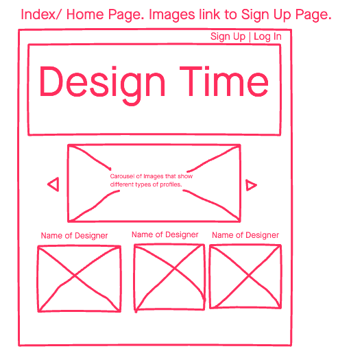
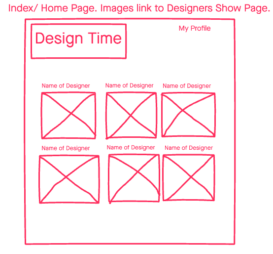
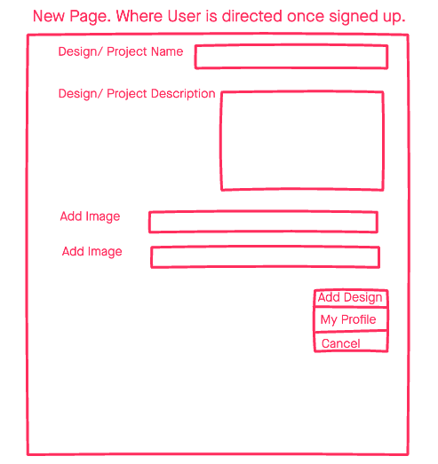
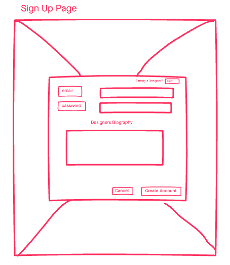
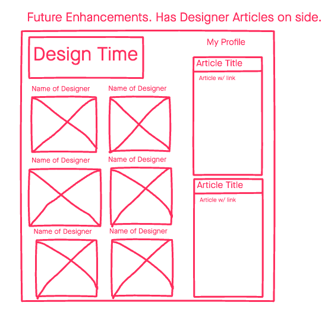

# Design Time

Have you wanted to show off your Carnival Costume Design but didn't know how? Welcome to Design Time where you can upload browse and be inspired by the many carnival cosstume designs.

## Technologies
- MongoDB
- Express
- JavaScript
- HTML
- CSS

 
 

## User Stories
- As a user I want to be able to see a preview of all of the Carnival Costume Designers Designs.
- As a user I should be able to see a Nav bar that directs me to log in/ sign up as a new designer submission.
- As a user, I should have a form where I can easily submit data such as Name, Description, Images in order to post it. I should also be able to update this information as many times as I need.
- As a user, I should be able to delete my account at anytime.
- As a user, once I am logged in I should be able to see all the details of the pervious submissions without being able to edit them.

 
 

# Screenshots

 
 

# Wireframes

 
 

# Getting Started

[Click here](https://design-time.herokuapp.com/) to see working app!
 
 

# Future Enchancements

